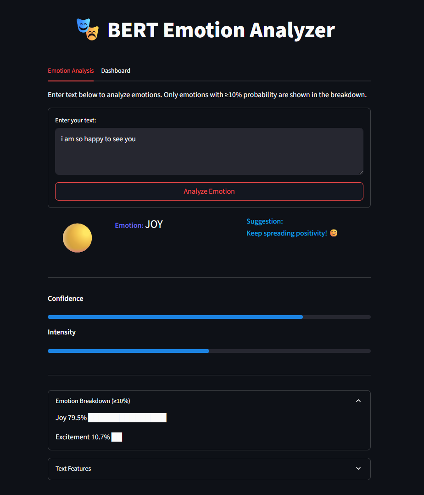
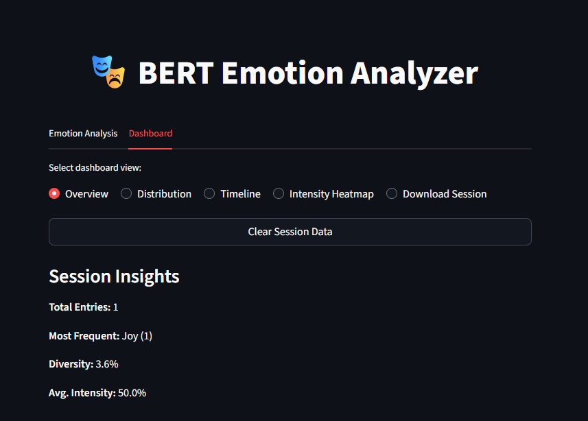

# 🎭 BERT Emotion Analyzer

A professional, multi-featured emotion analysis tool powered by BERT and Streamlit. Analyze emotions in text, visualize trends, and gain insights—all with a beautiful, modern UI.

---

## 🚀 Features
- **BERT-based multi-label emotion detection**
- **Confidence scoring & intensity analysis**
- **Text feature analysis** (caps, punctuation, emoji, repetition, etc.)
- **Personalized, emotion-aware suggestions**
- **Session-based emotion history & breakdowns**
- **User profiling & emotional insights**
- **Modern Streamlit web app** with:
  - Emotion breakdown (≥10% only)
  - Pie chart, timeline, intensity heatmap
  - Download session as CSV
  - Dark mode support
  - Responsive, professional UI/UX
- **CLI version** for terminal-based emotion analysis

---

## 🛠️ Setup

1. **Clone the repository:**
   ```bash
   git clone <your-repo-url>
   cd GOEMOTION_BERT
   ```
2. **Install dependencies:**
   ```bash
   pip install -r requirements.txt
   ```
   (Make sure you have `torch`, `transformers`, `streamlit`, `matplotlib`, `pandas`, `numpy`.)

3. **Download or train the BERT model:**
   - Place your trained model in `bert_emotion_model/` and the label file as `bert_emotion_labels.pkl`.
   - (See `bert_emotion_trainer.py` to train your own model.)

---

## 💻 Usage

### 1. **Streamlit Web App**
Run:
```bash
streamlit run app.py
```
- Open the link in your browser.
- Enter text for emotion analysis.
- Explore the dashboard for insights, trends, and downloads.
- Switch between light/dark mode in Streamlit settings.

### 2. **Command-Line Interface (CLI)**
Run:
```bash
python bert_predict.py
```
- Enter text for emotion analysis in the terminal.
- Type `dashboard` for session analytics.
- Type `quit` to exit.

---

## 📁 Screenshots

### Home Page



### Dashboard Page



---

## �� Project Structure
```
GOEMOTION_BERT/
├── app.py                # Streamlit web app
├── bert_predict.py       # CLI emotion analyzer
├── bert_emotion_trainer.py # Model training script
├── bert_emotion_model/   # Trained BERT model directory
├── bert_emotion_labels.pkl # Pickled emotion labels
├── requirements.txt      # Python dependencies
├── README.md             # This file
└── ...                   # Data and other files
```

---

## 🙏 Credits
- Built with [BERT](https://huggingface.co/bert-base-uncased), [Streamlit](https://streamlit.io/), [PyTorch](https://pytorch.org/), and your creativity!

---

## 📬 Feedback & Contributions
Pull requests and suggestions are welcome! 
